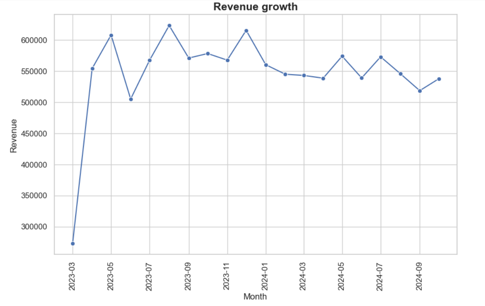
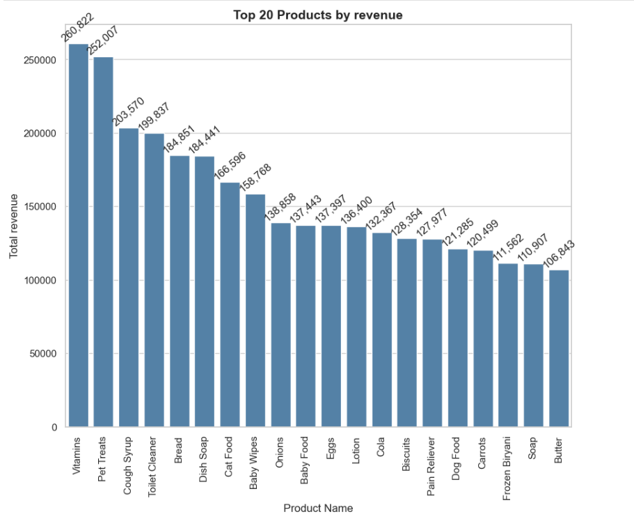
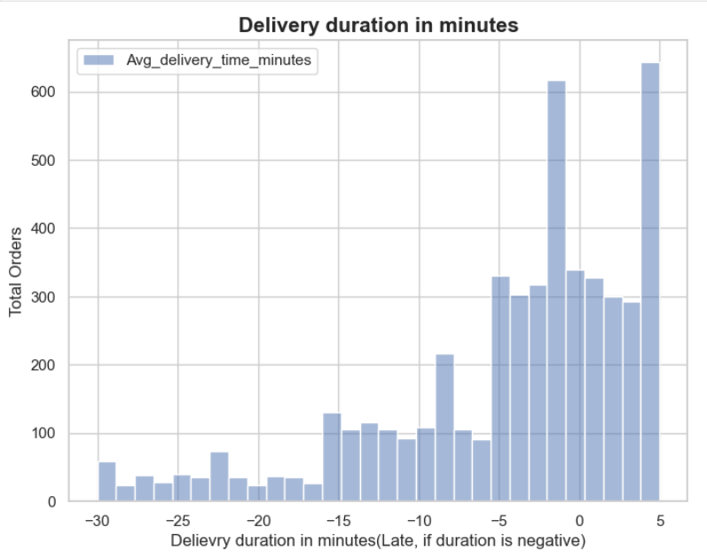
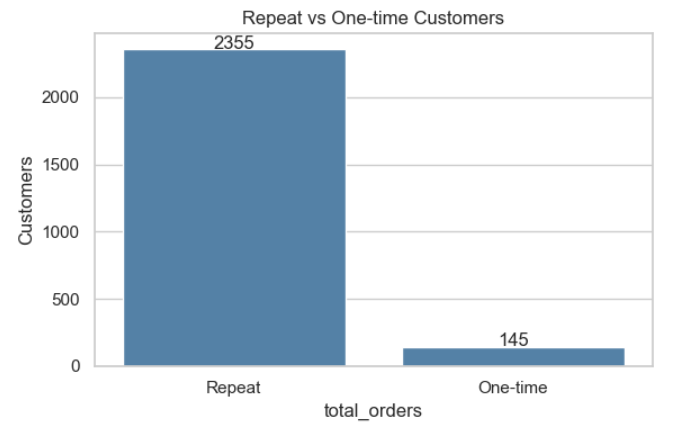

# Blinkit Business Analytics

## Project Overview

This project presents an end-to-end business analysis of Blinkit using Python. It explores multiple aspects of business performance, including sales trends, product and inventory performance, delivery efficiency, and customer behavior. The project demonstrates the complete data analysis workflow, from data cleaning and exploratory data analysis (EDA) to visualization and business insights.

---

## Business Objectives

- Analyze order trends and revenue performance.
- Evaluate product performance and inventory utilization.
- Assess delivery efficiency and operational performance.
- Understand customer acquisition, retention, and purchasing behavior.
- Generate actionable business insights to support data-driven decision-making.

---

## Tools & Technologies

- Python
- Pandas
- NumPy
- Matplotlib
- Seaborn
- Jupyter Notebook

---

## Repository Structure

```
Blinkit-Business-Analytics
│
├── Blinkit_datasets/
│
├── EDA_notebooks/
│   ├── Blinkit_orders.ipynb
│   ├── blinkit_products_inventory.ipynb
│   ├── Blinkit_delivery.ipynb
│   └── Blinkit_customers.ipynb
│
├── Images/
│   ├── revenue_analysis.png
│   ├── product_analysis.png
│   ├── delivery_analysis.png
│   └── customer_analysis.png
│
└── README.md
```

---

# Analysis Modules

## 1. Order Analysis

This notebook analyzes overall business sales performance by examining revenue, order trends, order values, and monthly business growth.

**Key Analyses**
- Revenue Trend
- Monthly Orders
- Revenue Distribution
- Average Order Value
- Order Growth Analysis

---

## 2. Product & Inventory Analysis

This notebook evaluates product performance and inventory utilization to identify high-performing products and inventory optimization opportunities.

**Key Analyses**
- Product Revenue Analysis
- Product Demand
- Inventory Level Analysis
- Category Performance
- Stock Utilization

---

## 3. Delivery Performance Analysis

This notebook focuses on operational efficiency by analyzing delivery performance across orders, delivery partners, and stores.

**Key Analyses**
- Delivery Status
- Delivery Time Analysis
- Delivery Partner Performance
- Store Performance
- On-time Delivery Analysis

---

## 4. Customer Analysis

This notebook analyzes customer behavior, purchasing patterns, customer value, and retention opportunities.

**Key Analyses**
- Customer Registration Trend
- Repeat vs One-time Customers
- Customer Lifetime Value
- Customer Segmentation
- Customer Recency Analysis
- Customer Churn Analysis

---

# Project Preview

## Order Analysis



---

## Product & Inventory Analysis



---

## Delivery Performance Analysis



---

## Customer Analysis



---

# Key Business Insights

- Order trends indicate stable business activity with consistent customer demand over time.
- Product analysis identifies high-performing products and highlights opportunities for inventory optimization.
- Delivery performance evaluation helps identify operational bottlenecks and opportunities to improve delivery efficiency.
- Customer analysis reveals a high repeat purchase rate, indicating strong customer retention and loyalty.
- Regular customers contribute the highest overall revenue, while newly acquired customers currently exhibit the highest average customer lifetime value.
- Customer recency analysis highlights inactive customers who can be targeted through personalized re-engagement campaigns.
- Overall, the analysis demonstrates how data-driven decision-making can improve sales performance, inventory planning, operational efficiency, and customer retention.

---

# Skills Demonstrated

- Data Cleaning
- Exploratory Data Analysis (EDA)
- Business Analytics
- Customer Analytics
- Sales Analytics
- Inventory Analysis
- Operations Analytics
- Data Visualization
- Python
- Pandas
- Matplotlib
- Seaborn

---

# Author

**Pannaga Hebbar**
